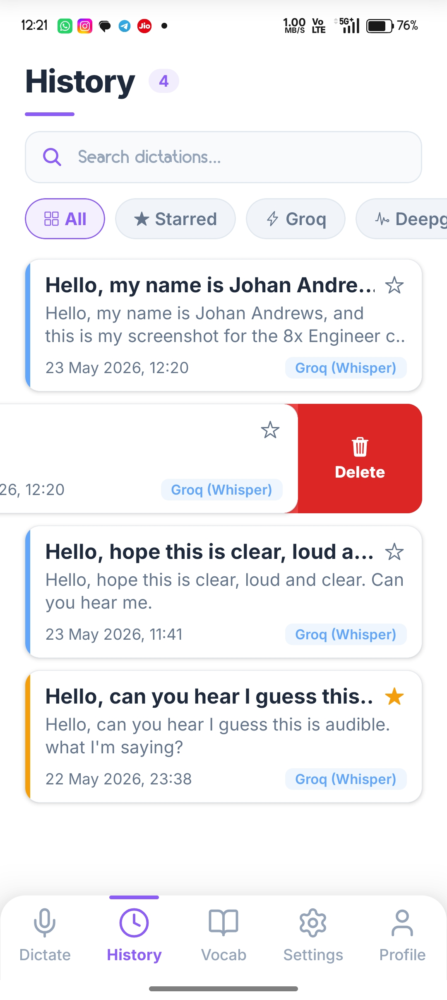
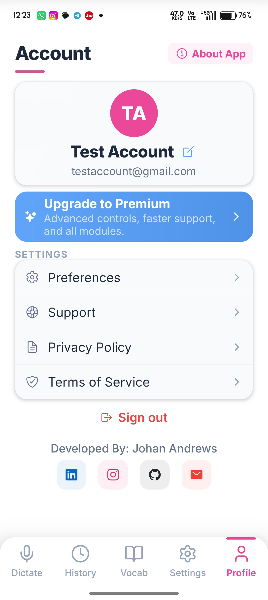

<div align="center">

#  🎙️ VoiceFlow AI

### *Speak. Think. Create.*

**An intelligent AI-powered voice dictation app that converts your speech into clean, formatted text — instantly.**

[](https://expo.dev)
[](https://reactnative.dev)
[](https://www.typescriptlang.org)
[](https://supabase.com)

---

> ### 📲 Download the App
>
>
> **🔗 [Click here to download the APK (Preview Build)](https://expo.dev/accounts/johanandrews/projects/flowvoice-ai/builds/51116819-0f6a-41ac-b0f4-f40806a7279f)**
>
> 🚀 **[✨ CLICK HERE TO TRY THE LIVE WEB APP DEMO ✨](https://speech-to-text-app-johan.vercel.app/)** 🚀
>
> *Scan the QR code from your Android device or click the links above to install or view the app.*

---

</div>

## 📸 App Screenshots

<div align="center">
  
  
  
</div>

<br/>

## ✨ Features at a Glance

| Feature | Description |
|---------|------------|
| 🎙️ **AI Voice Transcription** | Record and transcribe speech using Groq (Whisper), Deepgram, OpenAI, or on-device fallback |
| ✨ **AI Grammar Cleanup** | Llama-3 powered post-processing that fixes stutters, adds punctuation, and polishes text |
| 🤖 **AI Agent Mode** | Conversational voice assistant — ask questions, get intelligent answers hands-free |
| 📋 **Smart Clipboard** | Copy, share, or export transcriptions with one tap |
| 📚 **Dictation History** | Rolling log of your last 10 dictations with search, filter, star, and swipe actions |
| 🗣️ **Custom Vocabulary** | Teach the AI your brand names, acronyms, medical/legal terms for perfect spelling |
| 🌐 **18 Languages** | English, Spanish, French, German, Portuguese, Italian, Chinese, Japanese, Korean, and more |
| 🗣️ **Voice Commands** | Say "new paragraph", "comma", "period" — they become real formatting |
| 📴 **Offline Fallback** | On-device speech recognition when you have no internet |
| 🔐 **Secure Auth** | Email/password authentication with Supabase |
| ⭐ **Swipe Actions** | Swipe right to star/unstar, swipe left to delete — with smooth spring animations |

---

## 🎨 App Design

The app features a **premium light-mode design** with:

- 🔵 **Blue accent** for Dictate tab
- 🟣 **Purple accent** for History tab & AI Agent mode
- 🟢 **Emerald accent** for Vocabulary tab
- 🟡 **Amber accent** for Settings tab
- 🩷 **Pink accent** for Profile tab
- 🌊 **Smooth tab transitions** with cross-fade animations
- ✨ **Micro-animations** on buttons, cards, and swipe gestures
- 🎯 **Category-specific colors** across vocabulary items and filter chips

---

## 🏗️ Tech Stack

| Layer | Technology | Version |
|-------|-----------|---------|
| **Framework** | Expo | ~55.0.14 |
| **Runtime** | React Native | 0.83.4 |
| **Language** | TypeScript | ~5.9 |
| **Routing** | expo-router | ~55.0.12 |
| **Styling** | NativeWind + TailwindCSS | ^4.2 / ^3.4 |
| **Auth + Database** | Supabase (supabase-js) | ^2.100 |
| **Data Fetching** | TanStack React Query | ^5.99 |
| **Animations** | React Native Reanimated | 4.2.1 |
| **Audio Recording** | expo-av | ^16.0.8 |
| **Speech Recognition** | expo-speech-recognition | ^3.1.3 |
| **Icons** | Lucide + Ionicons (@expo/vector-icons) | Latest |
| **Internationalization** | i18next + react-i18next | ^26 / ^17 |
| **Bottom Sheets** | @gorhom/bottom-sheet | ^5.2.8 |
| **Gradients** | expo-linear-gradient | ~55.0.13 |
| **Blur Effects** | expo-blur | ~55.0.14 |
| **Haptics** | expo-haptics | ~55.0.14 |
| **Clipboard** | expo-clipboard | ~55.0.13 |
| **Share** | expo-sharing | ~55.0.19 |
| **Secure Storage** | expo-secure-store | ~55.0.13 |
| **File System** | expo-file-system | ~55.0.21 |
| **SVG** | react-native-svg | 15.15.3 |
| **Markdown** | react-native-markdown-display | ^7.0.2 |
| **Testing** | Jest + jest-expo | ^29 / ^55 |

---

## 🤖 AI Models & Providers

VoiceFlow AI uses a **smart fallback chain** for maximum reliability:

```
🥇 Groq Cloud (Whisper Large v3)     → Ultra-fast, free tier, ~0.5s latency
🥈 Deepgram (Nova-2)                  → Free $200 credit, streaming support
🥉 OpenAI Whisper API                 → Reliable paid fallback ($0.006/min)
🏠 On-Device (expo-speech-recognition) → No internet needed, emergency fallback
```

**Post-Processing:** Groq + Llama-3.1-8B-Instant for real-time grammar cleanup, stutter removal, and intelligent formatting.

---

## 📁 Project Structure

```
voiceflow-ai/
├── 📱 app/
│   ├── _layout.tsx              # Root layout — providers + auth routing
│   ├── (auth)/
│   │   ├── login.tsx            # Email/password login
│   │   └── register.tsx         # Registration with confirm password + eye toggle
│   ├── (tabs)/
│   │   ├── _layout.tsx          # Tab bar config with shift animations
│   │   ├── index.tsx            # 🎙️ Dictate — main recording screen
│   │   ├── history.tsx          # 📚 History — search, filter, swipe actions
│   │   ├── vocabulary.tsx       # 🗣️ Vocabulary — custom word management
│   │   ├── settings.tsx         # ⚙️ Settings — preferences + language picker
│   │   └── profile.tsx          # 👤 Profile — account, social links, about
│   └── session/
│       └── [id].tsx             # Session detail view
├── 🧩 components/
│   ├── MicButton.tsx            # Animated recording button (pulse + scale)
│   ├── TranscriptionCard.tsx    # Swipeable history card (star/delete)
│   ├── WaveformVisualizer.tsx   # Real-time audio waveform display
│   ├── ProviderBadge.tsx        # Transcription provider indicator
│   ├── TabBar.tsx               # Custom animated bottom tab bar
│   └── ui/                      # Reusable UI primitives
├── 🔌 contexts/
│   ├── TranscriptionContext.tsx  # Global transcription state + config
│   └── SubscriptionContext.tsx   # Premium subscription state
├── 🪝 hooks/
│   ├── useAudioRecorder.ts      # Audio recording with haptics
│   ├── useDictationHistory.ts   # History CRUD with TanStack Query
│   ├── useCustomVocabulary.ts   # Vocabulary CRUD
│   └── useProfile.ts            # User profile management
├── 📚 lib/
│   ├── transcription/           # Multi-provider transcription engine
│   │   ├── config.ts            # Provider priority + fallback config
│   │   ├── groq.ts              # Groq (Whisper) client
│   │   ├── deepgram.ts          # Deepgram client
│   │   ├── openai.ts            # OpenAI Whisper client
│   │   ├── native.ts            # On-device fallback
│   │   └── index.ts             # Orchestrator with automatic fallback
│   ├── aiCleanup.ts             # Llama-3 grammar cleanup + voice commands
│   ├── theme.ts                 # 🎨 Design tokens (59 color variables)
│   ├── supabase.ts              # Supabase client initialization
│   └── constants.ts             # App identity constants
├── 📊 supabase/
│   └── migrations/              # Database schema + RLS policies
├── 🤖 ai-logs/                  # AI conversation logs (competition submission)
└── 📄 WHISPR_CLONE_BUILD_INSTRUCTIONS.md  # Primary build approach document
```

---

## 🗄️ Database Schema (Supabase)

```sql
-- 📋 Dictation Sessions
dictation_sessions (
  id            UUID PRIMARY KEY,
  user_id       UUID → auth.users(id),
  raw_text      TEXT,          -- Original transcription
  cleaned_text  TEXT,          -- AI-cleaned version
  provider      TEXT,          -- Which API was used
  duration_ms   INTEGER,       -- Transcription latency
  language      TEXT,          -- Language code (e.g., 'en')
  title         TEXT,          -- Auto-generated title
  is_starred    BOOLEAN,       -- User starred this session
  is_deleted    BOOLEAN,       -- Soft delete flag
  created_at    TIMESTAMPTZ
)

-- 📖 Custom Vocabulary
custom_vocabulary (
  id         UUID PRIMARY KEY,
  user_id    UUID → auth.users(id),
  word       TEXT NOT NULL,    -- The custom word/phrase
  category   TEXT,             -- Technical, Names, Medical, Legal, etc.
  created_at TIMESTAMPTZ
)
```

Both tables have **Row Level Security (RLS)** — users can only access their own data.

---

## 🚀 Getting Started

### Prerequisites

- **Node.js** ≥ 20 ([download](https://nodejs.org))
- **npm** ≥ 10
- **Expo Go** app on your phone ([Android](https://play.google.com/store/apps/details?id=host.exp.exponent) / [iOS](https://apps.apple.com/app/expo-go/id982107779))

### Installation

```bash
# 1. Clone the repository
git clone https://github.com/Johan-Andrews/VoiceFlow-AI.git
cd VoiceFlow-AI

# 2. Install dependencies
npm install

# 3. Set up environment variables
cp .env.example .env.local
# Fill in your Supabase URL + key and API keys

# 4. Start the development server
npx expo start
```

### Running on Device

```bash
# 📱 Scan the QR code with Expo Go app

# 🤖 Android Emulator
npx expo start --android

# 🍎 iOS Simulator (Mac only)
npx expo start --ios

# 🌐 Cross-network (different Wi-Fi)
npx expo start --tunnel
```

### Building APK

```bash
# Install EAS CLI
npm install -g eas-cli

# Login to Expo
eas login

# Build preview APK
eas build --platform android --profile preview

# Build production bundle
eas build --platform android --profile production
```

---

## ⚙️ Environment Variables

Create a `.env.local` file in the project root:

```bash
# Supabase (Required)
EXPO_PUBLIC_SUPABASE_URL=https://your-project.supabase.co
EXPO_PUBLIC_SUPABASE_PUBLISHABLE_KEY=your_anon_key

# Transcription API Keys (at least one required for cloud transcription)
EXPO_PUBLIC_GROQ_API_KEY=gsk_xxxxxxxxxxxx
EXPO_PUBLIC_DEEPGRAM_API_KEY=xxxxxxxxxxxx
EXPO_PUBLIC_OPENAI_API_KEY=sk-xxxxxxxxxxxx
```

> **Note:** The app gracefully degrades. If no cloud API keys are set, it falls back to on-device speech recognition.

---

## 🎯 Key User Flows

### 🎙️ Recording & Transcription
```
Tap Mic → Record Speech → Stop → Auto-Transcribe → AI Cleanup → Display Clean Text → Copy/Share
```

### 🤖 AI Agent Mode
```
Switch to Agent → Tap Mic → Ask Question → AI Processes → Markdown Response → Copy/Share
```

### ⭐ History Management
```
View History → Search/Filter → Swipe Right to Star → Swipe Left to Delete → Tap to View Details
```

### 🗣️ Custom Vocabulary
```
Add Word → Select Category → AI Learns → Future Transcriptions Spell It Correctly
```

---

## 👨‍💻 Developer

<div align="center">

**Johan Andrews**

[](https://www.linkedin.com/in/johan-andrews-3b9505312/)
[](https://www.instagram.com/johan_andrews)
[](https://github.com/Johan-Andrews)
[](mailto:johanandrews12@gmail.com)

</div>

---

## 🤖 AI Tools Used

This project was built with the assistance of multiple AI coding tools:

| Tool | Purpose |
|------|---------|
| **Claude Code** | Initial project scaffolding, architecture design, and core feature implementation |
| **Gemini 3.5 Flash (Antigravity)** | UI/UX debugging, swipe gesture fixes, layout optimization, and feature iteration |
| **Claude Opus 4.6 (Thinking)** | Advanced bug fixing (Android touch handling), visual design enhancements, and comprehensive UI overhaul |

> All AI conversation logs are available in the [`/ai-logs/`](./ai-logs/) directory.

---

## 📝 License

This project is private and proprietary. All rights reserved.

---

<div align="center">

**🎙️ VoiceFlow AI** — *Your voice, perfected by AI.*

Built with ❤️ using React Native, Expo, and Supabase

</div>
